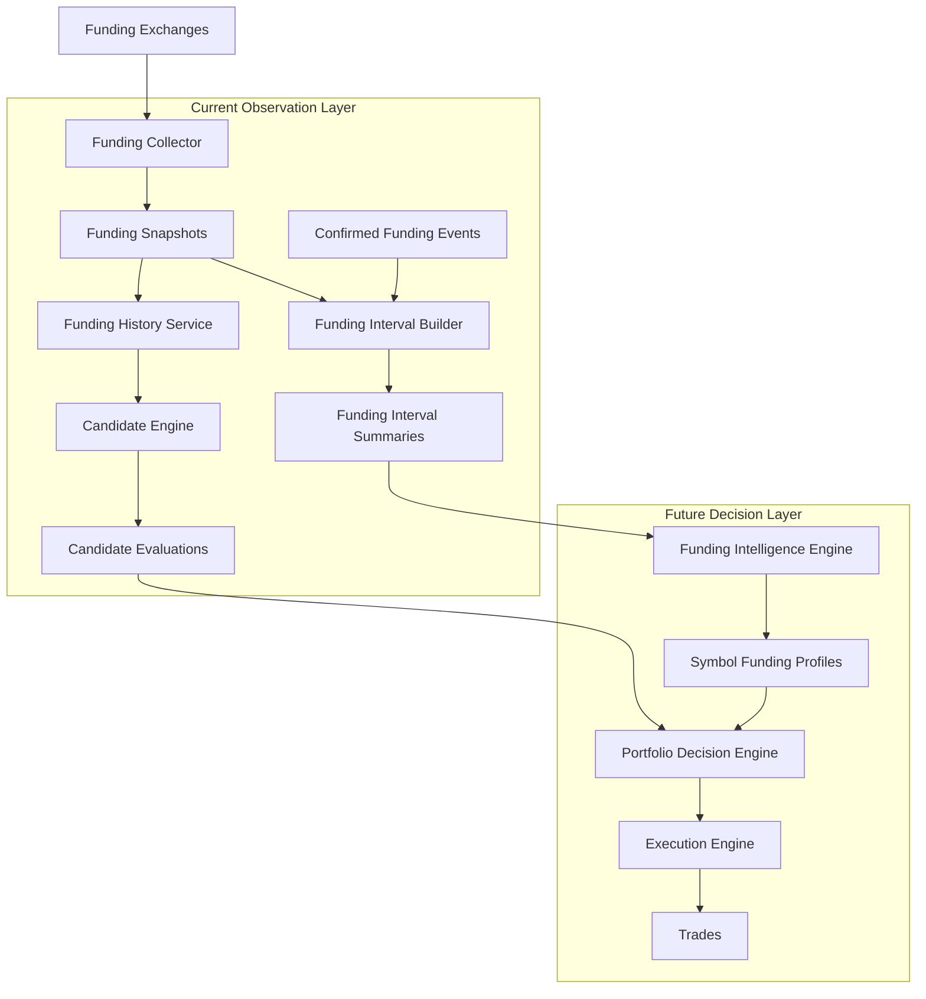

# Funding Rate Monitor Architecture Roadmap

## Purpose

This document is the main architecture roadmap for Funding Rate Monitor.

It is not a README. The README explains how to install and run the project. This
document explains how the system is expected to evolve, which module owns each
responsibility, and which boundaries must not be crossed as the project grows.

The document should be used as:

- a source of architecture decisions
- a guide for future stages
- a responsibility map for every major module
- a guard against God Objects
- a reference for future refactoring
- a shared language for discussing new features

The project is expected to evolve over many months. Architecture should favor
small composable services, explicit data contracts, deterministic calculations,
and clear separation between current signals, long-term intelligence, portfolio
decisions, and execution.

## Target System

The final system is a layered funding-arbitrage research and execution platform.
It starts with exchange market data and ends, in later stages, with risk-aware
trade execution.

Current implemented stages are still observation-only. The project must not
place orders until execution, risk, portfolio, and safety modules exist.



## Core Data Flow

The primary lifecycle is:

```text
Exchange
-> raw mark price update
-> FundingSnapshot
-> FundingHistoryService window
-> FundingMetrics
-> CandidateInput
-> CandidateEvaluation
-> confirmed FundingEvent
-> FundingIntervalSummary
-> SymbolFundingProfile
-> PortfolioDecision
-> ExecutionPlan
-> Trade
```

This flow has two separate analytical tracks:

1. Current opportunity detection:
   `FundingSnapshot -> FundingHistoryService -> CandidateEngine -> CandidateEvaluation`

2. Long-term intelligence:
   `FundingSnapshot + confirmed FundingEvent -> FundingIntervalBuilder -> FundingIntervalSummary -> FundingIntelligenceEngine -> SymbolFundingProfile`

These tracks must stay separate. Current signal quality answers whether a
symbol is interesting right now. Long-term intelligence answers whether a symbol
is generally worth trading.

## Module Responsibilities

### Funding Exchanges

Purpose:

Funding exchanges provide public and, in future execution stages, private market
or account APIs.

Current scope:

- Binance USD-M Futures public WebSocket mark price stream
- Binance public REST endpoints for exchange info and funding confirmation
- Binance public Spot exchange info for spot/futures mapping

Inputs:

- external exchange APIs
- network responses
- exchange metadata

Outputs:

- raw funding stream messages
- futures exchange info
- spot exchange info
- confirmed funding-rate records

Owns:

- nothing inside the project

Does not own:

- parsing business rules
- persistence
- scoring
- candidate classification
- portfolio decisions
- order execution policy

Allowed dependencies:

- HTTP/WebSocket client wrappers
- exchange adapters

Forbidden dependencies:

- repositories
- candidate engine
- funding intelligence
- portfolio engine
- execution decision logic

Architecture rule:

Exchange-specific behavior must be contained in exchange adapters. Multi-exchange
support should add adapters and exchange metadata, not branch exchange logic
through all services.

### Funding Collector

Purpose:

The collector receives funding-related public market data and converts it into
validated snapshots.

Inputs:

- WebSocket mark price updates
- active futures symbols
- collector timing settings

Outputs:

- `FundingSnapshot` rows
- funding event observation calls

Owns:

- WebSocket connection lifecycle
- reconnect behavior
- snapshot throttling
- conversion from `MarkPriceUpdate` to `FundingSnapshot`
- enqueueing snapshot persistence

Does not own:

- candidate scoring
- threshold policy beyond capture mode
- long-term statistics
- portfolio selection
- trading decisions
- risk limits
- execution

Allowed dependencies:

- exchange WebSocket client
- symbol repository
- snapshot service
- funding repository
- funding event service

Forbidden dependencies:

- `CandidateEngine`
- `FundingIntelligenceEngine`
- `PortfolioDecisionEngine`
- `ExecutionEngine`

Architecture rule:

Funding Collector answers only: "Did we receive useful market data, and should
we store this snapshot?" It never answers: "Should we trade?"

### Funding Snapshots

Purpose:

`FundingSnapshot` is the raw analytical fact for current predicted funding.

Inputs:

- parsed mark price update
- capture mode
- funding interval metadata
- receive timestamp

Outputs:

- persisted row in `funding_snapshots`
- in-memory history window item

Owns:

- timestamped predicted funding value
- mark price and index price
- premium rate
- next funding time
- direction at the time of observation
- capture mode

Does not own:

- realized funding
- candidate score
- long-term reliability
- portfolio allocation
- execution result

Allowed dependencies:

- pure model helpers
- Decimal conversion
- UTC datetime helpers

Forbidden dependencies:

- repository access inside the model
- candidate scoring
- exchange API calls
- trading logic

Architecture rule:

Snapshots are observations, not decisions.

### Funding History Service

Purpose:

`FundingHistoryService` maintains per-symbol in-memory windows and calculates
window metrics from stored snapshots.

Inputs:

- recent snapshots from repository
- live snapshots from collector
- configured window size
- funding threshold for metrics

Outputs:

- `WindowCacheSummary`
- per-symbol snapshot windows
- `FundingMetrics`

Owns:

- per-symbol window cache
- snapshot pruning by time window
- current, min, max, mean, median, standard deviation
- threshold persistence
- threshold crossings
- direction changes
- velocity
- acceleration
- history duration
- snapshot count

Does not own:

- mapping checks
- candidate status
- score weights
- portfolio ranking
- funding interval summaries
- long-term reliability

Allowed dependencies:

- snapshot repository protocol
- model helpers
- Decimal calculations

Forbidden dependencies:

- instrument mapping repository
- candidate repository
- funding intelligence
- portfolio engine
- execution engine

Architecture rule:

Funding History Service knows only funding history. It knows nothing about
trading, portfolios, or symbol quality.

### Candidate Engine

Purpose:

Candidate Engine answers one question:

```text
Is this positive funding opportunity worth considering right now?
```

Inputs:

- futures symbol
- exchange
- spot symbol
- spot mapping status
- positive strategy availability
- current predicted funding rate
- next funding time
- latest snapshot age
- `FundingMetricsCollection`
- `FundingSnapshotCollection`
- candidate engine configuration

Outputs:

- `CandidateEvaluation`

Owns:

- hard filters
- current opportunity status
- rejection reason codes
- warning flags
- current score
- score components
- late spike detection
- deterioration detection
- current ranking order

Does not own:

- snapshot collection
- exchange API calls
- SQL queries
- long-term statistics
- realized funding reliability
- symbol profiles
- portfolio allocation
- execution

Allowed dependencies:

- `FundingHistoryService` outputs
- instrument mapping data
- score calculators
- rule evaluator
- pure model helpers

Forbidden dependencies:

- direct PostgreSQL access
- exchange REST/WebSocket clients
- portfolio engine
- execution engine
- funding intelligence profile builders

Architecture rule:

Candidate Engine is a current-signal classifier. It must remain small enough to
answer only whether a symbol is currently interesting. It must not become a
general analytics engine.

### Candidate Rule Evaluator

Purpose:

Evaluates rule-based status constraints before and around scoring.

Inputs:

- `CandidateInput`
- candidate thresholds

Outputs:

- `CandidateRuleResult`

Owns:

- hard filter failure detection
- stale snapshot detection
- insufficient history detection
- spot mapping rejection reasons
- late spike flags
- deterioration flags
- unstable flags
- too early and too late flags

Does not own:

- score formulas
- persistence
- exchange calls
- portfolio decisions

Allowed dependencies:

- config values
- `CandidateInput`
- pure helper functions

Forbidden dependencies:

- repositories
- exchange clients
- funding intelligence
- execution

### Candidate Score Calculators

Purpose:

Score calculators isolate score component formulas.

Components:

- `FundingScoreCalculator`
- `PersistenceScoreCalculator`
- `StabilityScoreCalculator`
- `TrendScoreCalculator`
- `LifetimeScoreCalculator`
- `TimingScoreCalculator`
- `PenaltyCalculator`

Inputs:

- current funding
- persistence ratio
- metrics collection
- rule result
- candidate config

Outputs:

- Decimal component scores
- penalty map

Owns:

- formula for each score component
- formula for penalties

Does not own:

- candidate status
- hard filters
- persistence
- database writes
- ranking

Allowed dependencies:

- Decimal
- candidate config
- candidate metrics
- rule result

Forbidden dependencies:

- repository
- CLI
- exchange clients
- funding intelligence
- execution

Architecture rule:

Changing a formula must not require rewriting Candidate Engine. Future sigmoid,
logarithmic, or saturating funding score formulas belong inside
`FundingScoreCalculator`.

### Candidate Scoring Service

Purpose:

Coordinates score calculators and assembles `ScoreComponents`.

Inputs:

- `CandidateInput`
- `CandidateRuleResult`

Outputs:

- `ScoreComponents`

Owns:

- calculator orchestration
- base score summation
- total penalty summation
- final score clamp to `0..100`

Does not own:

- score component formulas
- rule classification
- persistence
- ranking

Allowed dependencies:

- score calculators
- candidate config

Forbidden dependencies:

- SQL
- exchange clients
- funding intelligence
- portfolio engine

### Candidate Evaluations

Purpose:

`CandidateEvaluation` is the persisted decision snapshot produced by Candidate
Engine.

Inputs:

- candidate rule result
- score components
- current predicted funding
- current metrics
- spot mapping information

Outputs:

- row in `candidate_evaluations`
- ranked CLI output
- rejection reason aggregates

Owns:

- evaluated timestamp
- exchange
- futures symbol
- spot symbol
- status
- score components
- rejection reasons
- warning flags
- metrics details
- engine version

Does not own:

- realized funding
- final trade decision
- symbol profile
- execution result

Allowed dependencies:

- candidate repository
- CLI formatting

Forbidden dependencies:

- exchange clients
- long-term profile calculations
- execution engine

### Candidate Repository

Purpose:

Persists and retrieves candidate evaluations and interval summaries.

Inputs:

- `CandidateEvaluation`
- `FundingIntervalSummary`
- query filters

Outputs:

- persisted rows
- latest evaluations
- rejection aggregates
- confirmed events and snapshots needed by interval analytics

Owns:

- SQL statements
- JSONB serialization
- Decimal preservation
- batch persistence
- idempotent upserts

Does not own:

- score calculations
- interval summary calculations
- business rules
- exchange API calls

Allowed dependencies:

- PostgreSQL connection pool
- model row mapping
- JSON serialization

Forbidden dependencies:

- `CandidateScoringService`
- `FundingIntervalBuilder` calculations
- exchange clients
- portfolio decision logic

Architecture rule:

Repository saves and loads. Repository does not calculate.

### Funding Events

Purpose:

`FundingEvent` represents one expected or confirmed funding settlement.

Inputs:

- snapshots before settlement
- Binance funding history confirmation

Outputs:

- row in `funding_events`
- input to `FundingIntervalBuilder`

Owns:

- funding time
- first and checkpoint predicted rates
- last predicted rate
- actual funding rate
- prediction error
- confirmation status

Does not own:

- candidate classification
- long-term reliability
- portfolio decisions

Allowed dependencies:

- funding repository
- confirmation service
- public funding history REST client

Forbidden dependencies:

- candidate scoring
- funding intelligence
- execution

### Funding Interval Builder

Purpose:

`FundingIntervalBuilder` converts one confirmed funding event and its related
snapshots into a `FundingIntervalSummary`.

Input:

```text
FundingEvent + list[FundingSnapshot]
```

Output:

```text
FundingIntervalSummary
```

Owns:

- interval start and end
- realized funding rate usage
- first and last predicted rates
- min, max, mean, median predicted rates
- peak predicted timestamp
- pre-funding point rates
- positive snapshot ratio
- above-threshold ratio
- threshold durations
- signal start
- positive streaks
- prediction error
- coverage ratio
- summary status

Does not own:

- SQL
- persistence
- candidate scoring
- profile ranking
- portfolio decisions

Allowed dependencies:

- `FundingEvent`
- `FundingSnapshot`
- Decimal helpers
- UTC datetime helpers

Forbidden dependencies:

- repository
- exchange clients
- Candidate Engine
- Funding Intelligence Engine
- portfolio engine

Architecture rule:

Builder receives data and returns a model. Builder never saves.

### Funding Interval Summaries

Purpose:

`FundingIntervalSummary` is the aggregated factual record of one funding
interval. It bridges predicted funding behavior and realized funding payout.

Inputs:

- confirmed `FundingEvent`
- snapshots with matching symbol and funding time

Outputs:

- row in `funding_interval_summaries`
- input to future Funding Intelligence Engine

Owns:

- interval-level facts
- prediction behavior before settlement
- realized payout
- prediction error
- coverage quality

Does not own:

- current candidate score
- symbol-level long-term statistics
- final portfolio decision
- execution outcome

Allowed dependencies:

- repository
- funding intelligence in future read-only mode

Forbidden dependencies:

- current snapshots after summary creation
- exchange clients
- portfolio decision engine
- execution engine

### Funding Intelligence Engine

Purpose:

Funding Intelligence Engine will answer:

```text
Which symbols are generally worth trading over time?
```

It is a future module. The placeholder exists now so the architecture has a
defined home for long-term analytics.

Inputs:

- `FundingIntervalSummary`
- future realized candidate outcomes
- future market-cost summaries

Outputs:

- `SymbolFundingProfile`
- long-term rankings
- reliability metrics
- signal frequency metrics

Owns:

- symbol profiles
- realized reliability
- signal frequency
- long-term funding statistics
- ranking inputs for portfolio decisions
- prediction error statistics
- drop-before-funding statistics

Does not own:

- current snapshot windows
- current Candidate Engine status
- order execution
- portfolio allocation
- raw collection

Allowed dependencies:

- funding interval summary repository
- profile repository
- pure profile calculators

Forbidden dependencies:

- current WebSocket snapshots
- Funding Collector
- Candidate Engine internals
- Execution Engine

Architecture rule:

Funding Intelligence works only on aggregated interval data. It must not depend
on current snapshots.

### Symbol Funding Profiles

Purpose:

`SymbolFundingProfile` stores multi-month symbol statistics.

Inputs:

- completed funding interval summaries
- future realized outcome summaries

Outputs:

- profile row in `symbol_funding_profiles`
- ranking inputs for Portfolio Decision Engine

Owns:

- first seen and last seen
- positive and negative realized event counts
- positive ratio
- average and median realized funding
- average positive funding
- high positive event count and ratio
- signal frequency
- realized reliability
- average prediction error
- average drop before funding
- profile JSON for future extensibility

Does not own:

- current candidate decision
- current predicted funding
- execution plan
- order results

Allowed dependencies:

- Funding Intelligence Engine
- profile repository

Forbidden dependencies:

- Funding Collector
- WebSocket clients
- current snapshot cache
- Execution Engine

### Portfolio Decision Engine

Purpose:

Portfolio Decision Engine will combine current candidates with long-term symbol
profiles and market constraints to choose the best opportunities.

Inputs:

- latest `CandidateEvaluation`
- `SymbolFundingProfile`
- future spread and fee data
- future liquidity metrics
- future risk constraints
- capital allocation settings

Outputs:

- ranked portfolio candidates
- proposed allocation
- execution intent

Owns:

- trade selection
- portfolio-level ranking
- capital allocation
- opportunity comparison
- risk-adjusted selection

Does not own:

- data collection
- candidate scoring formulas
- funding intelligence profile construction
- order placement

Allowed dependencies:

- Candidate Evaluation repository
- Symbol Funding Profile repository
- market-cost services
- risk configuration

Forbidden dependencies:

- Funding Collector
- raw exchange stream clients
- direct order APIs

Architecture rule:

Portfolio Engine decides what should be traded. It does not execute trades.

### Execution Engine

Purpose:

Execution Engine will convert approved portfolio decisions into orders.

Inputs:

- portfolio decision
- execution constraints
- account state
- exchange adapter
- risk approval

Outputs:

- execution plan
- orders
- fills
- trades
- execution outcome summary

Owns:

- order placement
- order monitoring
- fills
- execution outcome
- execution safety checks

Does not own:

- candidate score
- symbol reliability
- funding interval summaries
- portfolio selection

Allowed dependencies:

- private exchange adapters
- account state repository
- risk engine
- portfolio decisions

Forbidden dependencies:

- Funding Collector internals
- Funding History Service internals
- score calculators

Architecture rule:

Execution must be isolated and explicitly gated. No module before Execution
Engine should place orders or require private API keys.

### Trades

Purpose:

Trades are finalized execution records.

Inputs:

- execution fills
- order state
- fees
- realized funding outcomes

Outputs:

- trade ledger
- PnL reports
- feedback data for future analytics

Owns:

- executed quantities
- prices
- fees
- timestamps
- realized execution quality
- trade outcome

Does not own:

- signal generation
- portfolio decision logic
- exchange data collection

## Data Models

### FundingSnapshot

Stores one timestamped predicted funding observation.

Use it for:

- current predicted funding
- persistence
- trend
- stability
- late spike detection
- deterioration detection

Do not use it as:

- realized yield
- confirmed funding payout
- long-term reliability fact by itself

### FundingEvent

Stores one funding settlement lifecycle.

Use it for:

- expected funding time
- checkpoint predictions
- confirmed actual funding
- confirmation status
- prediction error

Do not use it for:

- current ranking without current snapshots
- portfolio allocation by itself

### CandidateEvaluation

Stores one Candidate Engine decision.

Use it for:

- current opportunity ranking
- current status
- score breakdown
- rejection diagnostics
- short-lived candidate state

Do not use it for:

- multi-month symbol reliability
- realized funding performance
- final trade decision by itself

### FundingIntervalSummary

Stores aggregated statistics for one complete or partial funding interval.

Use it for:

- comparing predicted and realized funding
- measuring prediction error
- measuring signal persistence before settlement
- building future symbol profiles

Do not use it for:

- direct execution
- current signal classification

### SymbolFundingProfile

Stores long-term exchange-symbol statistics.

Use it for:

- realized reliability
- signal frequency
- long-term ranking
- portfolio decision inputs

Do not use it for:

- current predicted funding
- live WebSocket state
- order placement

## Predicted Funding vs Realized Funding

Predicted Funding is the rate estimate that changes inside the current funding
interval. It comes from the mark price stream and is stored in snapshots.

Predicted Funding is used for:

- Candidate Engine
- persistence
- trend
- stability
- velocity
- acceleration
- late spike detection
- deterioration detection
- time-window current metrics

Realized Funding is the confirmed payout rate after settlement. It comes from
funding history confirmation and is stored in confirmed funding events.

Realized Funding is used for:

- long-term analytics
- symbol statistics
- reliability
- profile ranking
- historical performance
- future strategy selection

Never mix these concepts.

Invalid examples:

- treating max predicted funding inside an interval as realized yield
- using a temporary predicted spike as proof that a symbol is reliable
- ranking multi-month symbol quality from snapshots alone

Valid examples:

- using predicted funding to decide whether to observe a symbol now
- using realized funding to calculate long-term reliability
- using prediction error to compare expected and actual outcomes

## Signal Frequency vs Realized Reliability

Signal Frequency answers:

```text
How often did predicted funding become high?
```

Realized Reliability answers:

```text
How often did high predicted funding finish as high realized funding?
```

These metrics must always be calculated separately.

Signal Frequency examples:

- a symbol crossed `0.03%` predicted funding 20 times this month
- a symbol spent 15% of observed intervals above the threshold
- a symbol often produces candidate-like snapshots

Realized Reliability examples:

- high predicted funding remained high until settlement 70% of the time
- last predicted funding had low average error vs realized funding
- realized funding exceeded `0.03%` in 60% of high-signal intervals

Why separation matters:

- a symbol may spike often but collapse before settlement
- a symbol may generate fewer signals but pay reliably
- portfolio selection needs both signal availability and payout reliability

Architecture rule:

Signal Frequency belongs in Funding Intelligence, but it must not be merged into
Realized Reliability. Portfolio Decision Engine may combine both later, but the
profile layer must store them separately.

## Roadmap

### Stage 1: Collection and Confirmation

Implemented responsibilities:

- sync active futures symbols
- collect public mark price updates
- store funding snapshots
- create funding events
- confirm actual funding rates

### Stage 2: Analytical Data Foundation

Implemented responsibilities:

- PostgreSQL storage
- snapshot analytics columns
- in-memory history windows
- window metrics
- spot/futures instrument mapping

### Stage 3: Positive Funding Candidate Engine

Implemented responsibilities:

- current positive funding candidate detection
- hard filters
- score components
- rejection reasons
- candidate persistence
- funding interval summary foundation
- future funding intelligence placeholder

### Stage 4: Funding Intelligence

Planned responsibilities:

- build `SymbolFundingProfile`
- calculate Signal Frequency
- calculate Realized Reliability
- calculate long-term realized funding statistics
- calculate prediction error profiles
- rank symbols by historical funding quality

Must not:

- use current snapshots directly
- place orders
- choose portfolio allocation

### Stage 5: Market Cost and Liquidity Analysis

Planned responsibilities:

- spot/futures spread
- fees
- order book depth
- slippage estimates
- volume and liquidity
- open interest

Must not:

- replace Candidate Engine
- replace Funding Intelligence
- place orders

### Stage 6: Portfolio Decision Engine

Planned responsibilities:

- combine current candidate evaluations
- combine funding profiles
- combine market costs
- apply risk limits
- allocate capital
- produce execution intents

Must not:

- collect exchange data
- build symbol profiles
- place orders directly

### Stage 7: Execution Engine

Planned responsibilities:

- private API integration
- order planning
- order placement
- fill tracking
- execution outcome summaries

Must not:

- calculate candidate scores
- calculate symbol profiles
- decide portfolio allocation

### Stage 8: Risk Management

Planned responsibilities:

- exposure limits
- max loss constraints
- exchange and symbol concentration limits
- kill switch
- funding settlement risk controls
- execution pre-flight checks

### Stage 9: Analytics Dashboard

Planned responsibilities:

- candidate visibility
- profile visibility
- realized outcomes
- system health
- historical charts
- operational alerts

Must not:

- own business logic
- place orders
- modify core calculations

## Architecture Principles

### Single Responsibility

Every service must have one reason to change.

Examples:

- Collector changes when data collection changes.
- Candidate Engine changes when current signal rules change.
- Funding Intelligence changes when long-term profile logic changes.
- Portfolio Engine changes when allocation logic changes.
- Execution Engine changes when order behavior changes.

### Composition Over Inheritance

Prefer small calculators, builders, repositories, and services composed together.
Avoid inheritance trees for business logic.

### Services Are Independent

Services should communicate through typed models, not through hidden shared
state.

### Builder Does Not Save

Builders return models. They do not write to PostgreSQL and do not call
repositories.

### Repository Does Not Calculate

Repositories persist and load data. They do not compute scores, profiles,
reliability, or strategy decisions.

### Candidate Engine Does Not Know Portfolio

Candidate Engine evaluates the current symbol only. It does not compare capital
allocation across symbols.

### Portfolio Does Not Know Collection

Portfolio Decision Engine consumes prepared evaluations and profiles. It does
not know WebSocket streams or snapshot collection internals.

### Funding Intelligence Uses Aggregated Data

Funding Intelligence must use `funding_interval_summaries` and future outcome
summaries. It must not depend on current snapshots.

### Decimal for Financial Calculations

All financial values must use `Decimal`.

Forbidden:

- `float` for rates
- `float` for funding calculations
- `float` for prices, fees, spreads, slippage, PnL, or risk

### UTC Timestamps

All persisted timestamps must be timezone-aware UTC timestamps.

### No God Objects

No class should collect responsibilities from multiple architecture layers.

Warning signs:

- a collector importing candidate scoring
- a repository computing profile metrics
- a candidate engine placing orders
- a funding intelligence module reading WebSocket state
- a portfolio engine parsing exchange payloads

### Explicit Engine Versions

Scoring and profile algorithms should store engine versions. Future changes must
be distinguishable from historical calculations.

### Observation Before Execution

The project should remain observation-only until execution and risk modules are
explicitly implemented and tested.

## Dependency Rules

Allowed direction:

```text
Exchange Adapter
-> Collector
-> Repository
-> History Service
-> Candidate Engine
-> Candidate Repository
-> Funding Interval Builder
-> Funding Intelligence
-> Portfolio Decision
-> Execution
```

Read this as a conceptual data flow, not permission for every module to import
the next one.

Forbidden reverse dependencies:

- Collector must not import Portfolio or Execution.
- History Service must not import Portfolio or Execution.
- Candidate Engine must not import Repository or Exchange clients.
- Funding Intelligence must not import Collector or WebSocket clients.
- Repository must not import scoring calculators.
- Execution must not modify scoring or profile logic.

## Multi-Exchange Direction

The architecture is prepared for multiple exchanges through explicit `exchange`
fields in candidate and interval tables.

Multi-exchange support should be added by:

- exchange adapters
- exchange-specific symbol metadata
- exchange-aware repositories
- exchange-aware profiles

It should not be added by:

- hard-coding Binance assumptions through all services
- mixing exchange payload formats in Candidate Engine
- adding exchange-specific SQL branches in business logic

## Final Guidance

When adding a new feature, first decide which layer owns it.

If the feature answers "What is happening right now?", it likely belongs near
Candidate Engine.

If the feature answers "Is this symbol reliable over time?", it belongs in
Funding Intelligence.

If the feature answers "Which opportunity should use capital?", it belongs in
Portfolio Decision Engine.

If the feature answers "How do we place and monitor orders?", it belongs in
Execution Engine.

When ownership is unclear, do not add a shortcut dependency. Add a typed model or
small service boundary instead.
